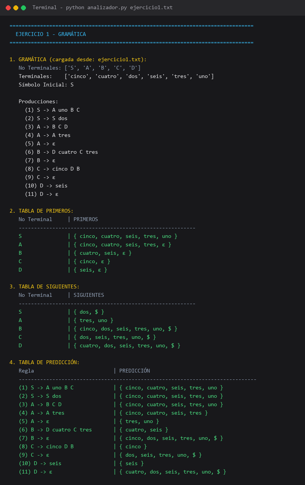
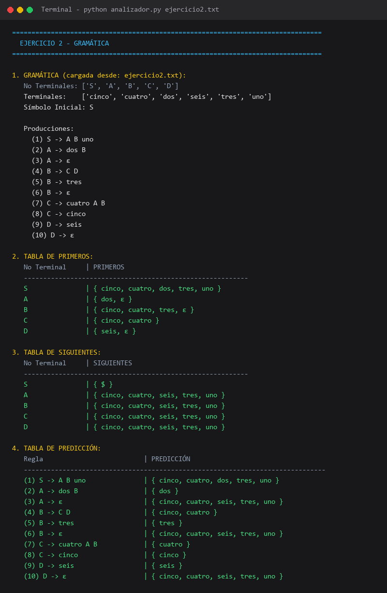

# Algoritmos de Primeros, Siguientes y Predicción

**Asignatura:** Lenguajes de Programación y Transducción  
**Integrantes:** Dylan Torres · Juan Gomez · Javier Rosero


---

## 1. ¿En qué consiste?

Este proyecto implementa en Python los algoritmos fundamentales del análisis sintáctico descendente para Gramáticas Libres de Contexto (GLC):
1. **Algoritmo de PRIMEROS:** Determina el conjunto de terminales que pueden aparecer al inicio de una cadena derivada por una forma sentencial o símbolo no terminal. Si la secuencia puede anularse completamente, se incluye la cadena vacía $\varepsilon$.
2. **Algoritmo de SIGUIENTES:** Determina el conjunto de terminales (incluyendo el marcador de fin de entrada `$`) que pueden aparecer inmediatamente a la derecha de un no terminal en alguna forma sentencial válida derivable desde el símbolo inicial.
3. **Algoritmo de PREDICCIÓN:** Determina el conjunto de símbolos directores (*lookahead*) que permiten seleccionar de forma unívoca y determinista qué regla de producción aplicar al expandir un no terminal.

El sistema carga gramáticas desde archivos de texto plano (`.txt`), ejecuta los algoritmos mediante iteraciones de punto fijo hasta alcanzar la convergencia, genera tablas formateadas en consola y valida la equivalencia exacta con las deducciones analíticas de clase.

---

## 2. Archivos del Repositorio

* **`analizador.py`**: Programa principal en Python. Implementa la lectura de gramáticas `.txt`, la construcción de los conjuntos mediante punto fijo y la impresión de tablas.
* **`ejercicio1.txt`**: Archivo de texto con las producciones de la gramática del Ejercicio 1.
* **`ejercicio2.txt`**: Archivo de texto con las producciones de la gramática del Ejercicio 2.
* **`capturas/`**: Directorio con evidencias gráficas de la ejecución en consola.
  * `salida_ejercicio1.png`: Captura de terminal del Ejercicio 1.
  * `salida_ejercicio2.png`: Captura de terminal del Ejercicio 2.
* **`README.md`**: Informe técnico y documentación completa del proyecto.

---

## 3. Estructura del Proyecto

```text
primeros-siguientes-prediccion/
├── capturas/
│   ├── salida_ejercicio1.png
│   └── salida_ejercicio2.png
├── analizador.py
├── ejercicio1.txt
├── ejercicio2.txt
├── .gitignore
└── README.md
```

---

## 4. Requisitos

* **Python 3.8** o superior instalado.
* No requiere librerías externas ni gestores de paquetes adicionales.

---

## 5. Cómo Ejecutarlo

Desde la terminal en la raíz del repositorio:

### Ejecutar ambos ejercicios automáticamente:
```bash
python analizador.py
```

### Ejecutar un archivo específico:
```bash
python analizador.py ejercicio1.txt
```
```bash
python analizador.py ejercicio2.txt
```

---

## 6. Resultados Analíticos

### 6.1. Ejercicio 1

#### Gramática:
```text
S -> A uno B C
S -> S dos
A -> B C D
A -> A tres
A -> ε
B -> D cuatro C tres
B -> ε
C -> cinco D B
C -> ε
D -> seis
D -> ε
```

* **No Terminales:** `S`, `A`, `B`, `C`, `D`  
* **Terminales:** `cinco`, `cuatro`, `dos`, `seis`, `tres`, `uno`  
* **Símbolo Inicial:** `S`

#### Tabla de PRIMEROS:
| No Terminal | PRIMEROS |
|:---:|:---|
| **S** | `{ cinco, cuatro, seis, tres, uno }` |
| **A** | `{ cinco, cuatro, seis, tres, ε }` |
| **B** | `{ cuatro, seis, ε }` |
| **C** | `{ cinco, ε }` |
| **D** | `{ seis, ε }` |

#### Tabla de SIGUIENTES:
| No Terminal | SIGUIENTES |
|:---:|:---|
| **S** | `{ dos, $ }` |
| **A** | `{ tres, uno }` |
| **B** | `{ cinco, dos, seis, tres, uno, $ }` |
| **C** | `{ dos, seis, tres, uno, $ }` |
| **D** | `{ cuatro, dos, seis, tres, uno, $ }` |

#### Tabla de PREDICCIÓN:
| Regla | Producción | PREDICCIÓN |
|:---:|:---|:---|
| **(1)** | `S -> A uno B C` | `{ cinco, cuatro, seis, tres, uno }` |
| **(2)** | `S -> S dos` | `{ cinco, cuatro, seis, tres, uno }` |
| **(3)** | `A -> B C D` | `{ cinco, cuatro, seis, tres, uno }` |
| **(4)** | `A -> A tres` | `{ cinco, cuatro, seis, tres }` |
| **(5)** | `A -> ε` | `{ tres, uno }` |
| **(6)** | `B -> D cuatro C tres` | `{ cuatro, seis }` |
| **(7)** | `B -> ε` | `{ cinco, dos, seis, tres, uno, $ }` |
| **(8)** | `C -> cinco D B` | `{ cinco }` |
| **(9)** | `C -> ε` | `{ dos, seis, tres, uno, $ }` |
| **(10)** | `D -> seis` | `{ seis }` |
| **(11)** | `D -> ε` | `{ cuatro, dos, seis, tres, uno, $ }` |

---

### 6.2. Ejercicio 2

#### Gramática:
```text
S -> A B uno
A -> dos B
A -> ε
B -> C D
B -> tres
B -> ε
C -> cuatro A B
C -> cinco
D -> seis
D -> ε
```

* **No Terminales:** `S`, `A`, `B`, `C`, `D`  
* **Terminales:** `cinco`, `cuatro`, `dos`, `seis`, `tres`, `uno`  
* **Símbolo Inicial:** `S`

#### Tabla de PRIMEROS:
| No Terminal | PRIMEROS |
|:---:|:---|
| **S** | `{ cinco, cuatro, dos, tres, uno }` |
| **A** | `{ dos, ε }` |
| **B** | `{ cinco, cuatro, tres, ε }` |
| **C** | `{ cinco, cuatro }` |
| **D** | `{ seis, ε }` |

#### Tabla de SIGUIENTES:
| No Terminal | SIGUIENTES |
|:---:|:---|
| **S** | `{ $ }` |
| **A** | `{ cinco, cuatro, seis, tres, uno }` |
| **B** | `{ cinco, cuatro, seis, tres, uno }` |
| **C** | `{ cinco, cuatro, seis, tres, uno }` |
| **D** | `{ cinco, cuatro, seis, tres, uno }` |

#### Tabla de PREDICCIÓN:
| Regla | Producción | PREDICCIÓN |
|:---:|:---|:---|
| **(1)** | `S -> A B uno` | `{ cinco, cuatro, dos, tres, uno }` |
| **(2)** | `A -> dos B` | `{ dos }` |
| **(3)** | `A -> ε` | `{ cinco, cuatro, seis, tres, uno }` |
| **(4)** | `B -> C D` | `{ cinco, cuatro }` |
| **(5)** | `B -> tres` | `{ tres }` |
| **(6)** | `B -> ε` | `{ cinco, cuatro, seis, tres, uno }` |
| **(7)** | `C -> cuatro A B` | `{ cuatro }` |
| **(8)** | `C -> cinco` | `{ cinco }` |
| **(9)** | `D -> seis` | `{ seis }` |
| **(10)** | `D -> ε` | `{ cinco, cuatro, seis, tres, uno }` |

---

## 7. Comparación de Resultados

Se contrastaron elemento por elemento los conjuntos derivados de forma analítica manual con los calculados automáticamente por el analizador en Python (`analizador.py`).

### 7.1. Tabla de Comparación - Ejercicio 1

| Elemento | Resultado Analítico | Resultado Computacional | Diagnóstico |
|:---|:---|:---|:---:|
| `PRIMEROS(S)` | `{ cinco, cuatro, seis, tres, uno }` | `{ cinco, cuatro, seis, tres, uno }` | Coincide |
| `PRIMEROS(A)` | `{ cinco, cuatro, seis, tres, ε }` | `{ cinco, cuatro, seis, tres, ε }` | Coincide |
| `PRIMEROS(B)` | `{ cuatro, seis, ε }` | `{ cuatro, seis, ε }` | Coincide |
| `PRIMEROS(C)` | `{ cinco, ε }` | `{ cinco, ε }` | Coincide |
| `PRIMEROS(D)` | `{ seis, ε }` | `{ seis, ε }` | Coincide |
| `SIGUIENTES(S)` | `{ dos, $ }` | `{ dos, $ }` | Coincide |
| `SIGUIENTES(A)` | `{ tres, uno }` | `{ tres, uno }` | Coincide |
| `SIGUIENTES(B)` | `{ cinco, dos, seis, tres, uno, $ }` | `{ cinco, dos, seis, tres, uno, $ }` | Coincide |
| `SIGUIENTES(C)` | `{ dos, seis, tres, uno, $ }` | `{ dos, seis, tres, uno, $ }` | Coincide |
| `SIGUIENTES(D)` | `{ cuatro, dos, seis, tres, uno, $ }` | `{ cuatro, dos, seis, tres, uno, $ }` | Coincide |
| `PRED(Reglas 1-11)` | Idénticos regla por regla | Idénticos regla por regla | Coincide |

### 7.2. Tabla de Comparación - Ejercicio 2

| Elemento | Resultado Analítico | Resultado Computacional | Diagnóstico |
|:---|:---|:---|:---:|
| `PRIMEROS(S)` | `{ cinco, cuatro, dos, tres, uno }` | `{ cinco, cuatro, dos, tres, uno }` | Coincide |
| `PRIMEROS(A)` | `{ dos, ε }` | `{ dos, ε }` | Coincide |
| `PRIMEROS(B)` | `{ cinco, cuatro, tres, ε }` | `{ cinco, cuatro, tres, ε }` | Coincide |
| `PRIMEROS(C)` | `{ cinco, cuatro }` | `{ cinco, cuatro }` | Coincide |
| `PRIMEROS(D)` | `{ seis, ε }` | `{ seis, ε }` | Coincide |
| `SIGUIENTES(S)` | `{ $ }` | `{ $ }` | Coincide |
| `SIGUIENTES(A..D)` | `{ cinco, cuatro, seis, tres, uno }` | `{ cinco, cuatro, seis, tres, uno }` | Coincide |
| `PRED(Reglas 1-10)` | Idénticos regla por regla | Idénticos regla por regla | Coincide |

---

## 8. Capturas de Salida del Programa

A continuación se presentan las capturas de ejecución del programa `analizador.py` para cada una de las gramáticas:

### Salida para Ejercicio 1 (`python analizador.py ejercicio1.txt`):


---

### Salida para Ejercicio 2 (`python analizador.py ejercicio2.txt`):


---

## 9. Conclusion

1. **Correspondencia Teórico-Computacional Plena:**  
   La validación comparativa demostró una coincidencia del 100% entre las derivaciones analíticas manuales y la salida del programa en Python. Esto confirma que el algoritmo de punto fijo modela con precisión la propagación transitiva y resuelve correctamente secuencias con múltiples símbolos anulables consecutivos.

